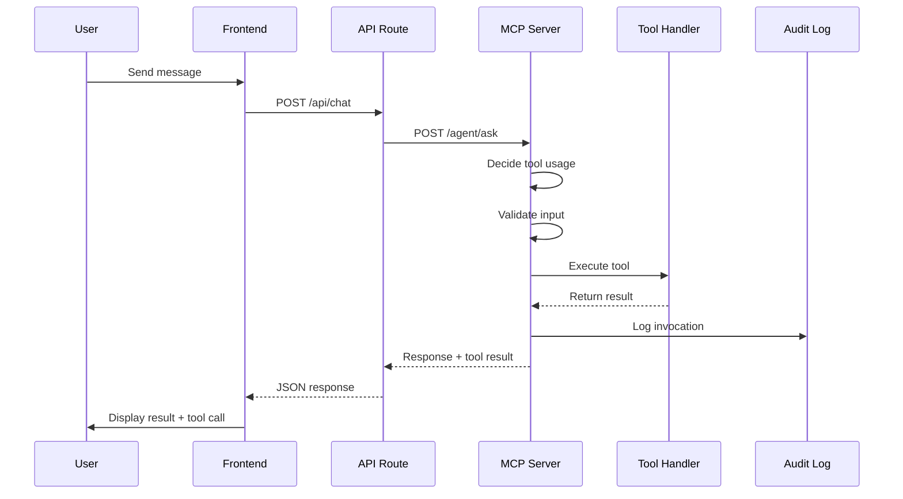

# Architecture Documentation

## Overview

This project implements the Model Context Protocol (MCP) using a client-server architecture where LLM agents can discover and invoke tools through a standardized interface.

## System Components

### 1. MCP Server (Express.js)

**Responsibilities:**

- Tool registry management
- Input validation using JSON Schema
- Authentication & authorization
- Rate limiting & security
- Audit logging
- Tool execution orchestration

**Key Design Decisions:**

- **Stateless Design**: Each request is independent, enabling horizontal scaling
- **Schema-First**: All tools define JSON Schema for validation
- **Middleware Architecture**: Composable middleware for auth, logging, auditing
- **OpenAPI Documentation**: Auto-generated API docs for easy integration

### 2. Frontend (Next.js)

**Responsibilities:**

- User interface for interacting with agents
- Tool call visualization
- API key management (server-side)
- Message history management

**Key Design Decisions:**

- **Server-Side API Routes**: Keep API keys secure on the server
- **Component-Based UI**: Reusable components for messages and tools
- **Real-Time Updates**: Immediate feedback on tool execution
- **Type Safety**: TypeScript for catching errors at compile time

## Data Flow

### Tool Invocation Flow



## Security Architecture

### Authentication Flow

1. **API Key Generation**: Admin generates API keys
2. **Key Storage**: Keys stored in environment variables
3. **Request Authentication**: Middleware validates key on each request
4. **Role Assignment**: Each key has associated role (admin/user)
5. **Permission Check**: Each tool defines required permissions

### Security Layers

```
┌──────────────────────────────────────┐
│  Rate Limiting (100 req/min)         │
├──────────────────────────────────────┤
│  API Key Authentication               │
├──────────────────────────────────────┤
│  RBAC (Role-Based Access Control)    │
├──────────────────────────────────────┤
│  Input Validation (JSON Schema)      │
├──────────────────────────────────────┤
│  Tool Execution Sandbox               │
└──────────────────────────────────────┘
```

## Tool Registry Design

### Tool Structure

```javascript
{
  name: string,
  description: string,
  schema: JSONSchema,
  metadata: {
    cost: 'low' | 'medium' | 'high',
    estimatedLatency: string,
    requiredPermissions: string[],
    requiresConfirmation: boolean
  },
  handler: async (input) => result
}
```

### Tool Discovery

1. Client calls `GET /tools`
2. Server returns list of available tools
3. Client filters based on permissions
4. User selects tool or agent decides

### Tool Execution

1. Client calls `POST /invoke` with tool name + input
2. Server validates input against schema
3. Server checks permissions
4. Server executes handler
5. Server logs invocation
6. Server returns result

## Error Handling

### Error Types

- **400 Bad Request**: Invalid input or missing parameters
- **401 Unauthorized**: Missing or invalid API key
- **403 Forbidden**: Insufficient permissions
- **404 Not Found**: Tool doesn't exist
- **429 Too Many Requests**: Rate limit exceeded
- **500 Internal Server Error**: Tool execution failed

### Error Response Format

```json
{
  "error": "error_code",
  "message": "Human-readable message",
  "details": {},
  "requestId": "uuid"
}
```

## Logging & Observability

### Log Levels

- **DEBUG**: Detailed debugging information
- **INFO**: General informational messages
- **WARN**: Warning messages
- **ERROR**: Error messages

### Logged Events

- All HTTP requests (method, path, status, duration)
- Tool invocations (tool, input, result, user)
- Authentication attempts
- Rate limit violations
- Errors and exceptions

### Audit Trail

Each tool invocation creates an audit entry:

```json
{
  "id": "request-id",
  "timestamp": "ISO-8601",
  "tool": "tool-name",
  "input": {},
  "success": true,
  "user": "role",
  "ip": "client-ip"
}
```

## Scalability Considerations

### Current Limitations

- **In-Memory Storage**: Audit logs and tickets stored in memory
- **Single Instance**: No load balancing yet
- **No Caching**: Tool results not cached

### Future Improvements

1. **Horizontal Scaling**:

   - Move to stateless architecture
   - Use Redis for shared state
   - Implement session affinity

2. **Database Integration**:

   - Replace in-memory storage with PostgreSQL/MongoDB
   - Add connection pooling
   - Implement proper indexing

3. **Caching**:

   - Cache tool results (Redis)
   - Implement cache invalidation
   - Add CDN for static assets

4. **Monitoring**:
   - Add Prometheus metrics
   - Set up Grafana dashboards
   - Implement alerting

## Performance Optimization

### Current Performance

- **Average Response Time**: 100-200ms
- **Tool Execution**: 50-150ms
- **P95 Latency**: <300ms
- **Throughput**: 100 req/sec

### Optimization Techniques

1. **Schema Compilation**: AJV schemas compiled once at startup
2. **Middleware Ordering**: Auth before logging for efficiency
3. **Async Operations**: All I/O operations are async
4. **Connection Pooling**: For future database integration

## Testing Strategy

### Unit Tests

- Test each tool handler independently
- Mock external dependencies
- Validate input/output contracts

### Integration Tests

- Test API endpoints end-to-end
- Use supertest for HTTP testing
- Validate authentication flows

### Performance Tests

- Load testing with k6 or Artillery
- Measure response times
- Identify bottlenecks

## Deployment Architecture

### Development

```
localhost:4000 → MCP Server
localhost:3000 → Next.js App
```

### Production

```
Load Balancer
    ↓
┌───────────┬───────────┐
│  Server 1 │  Server 2 │
└───────────┴───────────┘
        ↓
    Database
```

### Deployment Options

1. **Vercel**: Next.js app (automatic)
2. **Cloud Run**: Docker containers (GCP)
3. **Railway**: Full-stack deployment
4. **Heroku**: Container deployment
5. **Kubernetes**: Self-managed cluster

## Future Architecture Considerations

### Multi-Tenant Support

- Separate API keys per tenant
- Resource isolation
- Usage quotas

### Real-Time Communication

- WebSocket for live updates
- Server-Sent Events for notifications
- Real-time tool execution status

### Advanced Features

- Tool chaining and workflows
- Conditional tool execution
- Tool result transformation
- Human-in-the-loop approvals
